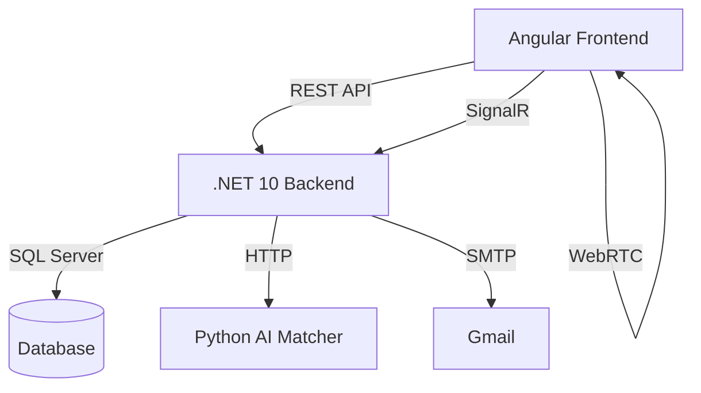

# GuzoGo — Technical Documentation

**Professional networking platform with real-time voice/video, AI-powered peer matching, and community spaces.**

| | |
|---|---|
| **Frontend** | Angular 22 |
| **Backend** | .NET 10 (ASP.NET Core Web API) |
| **Database** | SQL Server |
| **Real-time** | SignalR, WebRTC |
| **AI Service** | Python 3.13, FastAPI, Sentence-Transformers |
| **License** | MIT |

---

## Table of Contents

1. [Introduction](#1-introduction)
2. [Features](#2-features)
3. [System Architecture](#3-system-architecture)
4. [Technology Stack](#4-technology-stack)
5. [Project Structure](#5-project-structure)
6. [Getting Started](#6-getting-started)
7. [Configuration](#7-configuration)
8. [API Reference](#8-api-reference)
9. [SignalR Hubs](#9-signalr-hubs)
10. [WebRTC Signaling & Real-Time Communication](#10-webrtc-signaling--real-time-communication)
11. [Known Issues & Troubleshooting](#11-known-issues--troubleshooting)
12. [Security Considerations](#12-security-considerations)
13. [Deployment](#13-deployment)
14. [License](#14-license)

---

## 1. Introduction

GuzoGo is a professional networking platform that combines real-time voice/video communication, AI-powered peer matching, and community spaces. It enables users to:

- Create and join **Spaces** (group rooms) with up to 6 participants for live discussions.
- Engage in **Peer Match**, an Omegle-style 1-on-1 video call system with AI matching.
- Build a professional profile and connect with others based on profession, skills, and goals.
- Communicate through video, audio, screen sharing, and chat in real time.

---

## 2. Features

### 2.1 Authentication & Security
- JWT authentication with access + refresh tokens.
- Email verification and password reset (via Gmail SMTP).
- Role-based authorization for hosts (mute/kick participants).
- Password-protected spaces.

### 2.2 User Profiles
- Professional profile with picture, bio, social links, skills, and profession.
- Profile picture upload (base64).
- View others' profiles during video calls.

### 2.3 Spaces (Group Rooms)
- Public/private rooms with up to 6 participants.
- Real-time video, audio, screen sharing, and chat.
- Host controls: mute/unmute, kick, hand raise.
- Share room links via copy, WhatsApp, Telegram.
- Private room password prompt.
- Multi-party WebRTC mesh with reliable ICE/TURN support.

### 2.4 Peer Match (1-on-1)
- AI-powered matchmaking based on profession, skills, goals, and free-text descriptions.
- "Next Match" feature that excludes the previous partner.
- Live video/audio with echo cancellation.
- View peer profile during the call.

### 2.5 AI Matching (Python Microservice)
- Semantic similarity matching using sentence-transformers.
- Goal compatibility scoring.
- Repeat-match penalty and exclusion logic.

---

## 3. System Architecture



| Component | Responsibility |
|---|---|
| **Angular** | UI rendering and WebRTC peer connections |
| **.NET** | REST APIs, SignalR hubs, business logic |
| **Python** | AI-based candidate ranking |
| **SQL Server** | Persistence for users, profiles, rooms, messages, match sessions |
| **WebRTC** | Mesh topology for multi-party calls (Spaces); peer-to-peer for 1-on-1 matches |

---

## 4. Technology Stack

| Layer | Technology |
|---|---|
| Frontend | Angular 22 (standalone components, signals) |
| Backend | .NET 10 (ASP.NET Core Web API, EF Core) |
| Database | SQL Server |
| Real-time | SignalR, WebRTC |
| AI Service | Python 3.13, FastAPI, Sentence-Transformers |
| Email | MailKit + Gmail SMTP |
| Auth | JWT (access + refresh tokens), BCrypt |

---

## 5. Project Structure

```
GuzoGo_APP/
├── Front-End/          # Angular 22 application
│   ├── src/app/
│   │   ├── core/       # Services, interceptors, guards
│   │   ├── features/   # Feature modules (auth, profile, space, dashboard)
│   │   ├── shared/     # Shared components (header, directives)
│   │   └── environments/
│   └── angular.json
│
├── Back-End/           # .NET 10 solution
│   ├── guzogo/
│   │   ├── Controllers/
│   │   ├── DTOs/
│   │   ├── Entities/
│   │   ├── Services/
│   │   ├── Hubs/       # SignalR hubs
│   │   ├── Helpers/    # JWT generator
│   │   └── Data/       # DbContext
│   └── guzogo.sln
│
├── ai-matcher/         # Python matching microservice
│   ├── main.py
│   ├── matcher.py
│   ├── models.py
│   └── requirements.txt
│
└── README.md
```

---

## 6. Getting Started

### 6.1 Prerequisites

- Node.js ≥ 18, Angular CLI
- .NET 10 SDK
- SQL Server
- Python 3.13
- Gmail account (with App Password) for email
- Optional: ngrok or local network for testing across devices

### 6.2 Backend Setup

1. Clone the repository and navigate to `Back-End/guzogo/guzogo`.
2. Set up User Secrets (recommended):
   ```bash
   dotnet user-secrets init
   dotnet user-secrets set "Jwt:Key" "your-256-bit-secret"
   dotnet user-secrets set "Smtp:Username" "your-email@gmail.com"
   dotnet user-secrets set "Smtp:Password" "your-app-password"
   dotnet user-secrets set "ConnectionStrings:DefaultConnection" "Server=localhost\SQLEXPRESS;Database=GuzoGoDB;Trusted_Connection=True;TrustServerCertificate=True;"
   ```
3. Update `appsettings.json` with non-sensitive defaults (issuer, audience, etc.).
4. Run database migrations:
   ```bash
   dotnet ef database update
   ```
5. Start the backend:
   ```bash
   dotnet run
   ```

### 6.3 Frontend Setup

1. Navigate to `Front-End`.
2. Install dependencies:
   ```bash
   npm install
   ```
3. Update `src/environments/environment.ts` and `environment.prod.ts` with the correct API URL.
4. Start the development server:
   ```bash
   ng serve
   ```

### 6.4 AI Matcher Setup

1. Navigate to `ai-matcher`.
2. Create a virtual environment:
   ```bash
   python -m venv venv
   source venv/bin/activate  # or venv\Scripts\activate on Windows
   ```
3. Install dependencies:
   ```bash
   pip install -r requirements.txt
   ```
4. Create a `.env` file:
   ```
   DOTNET_API_URL=http://localhost:5011
   ```
5. Run the service:
   ```bash
   uvicorn main:app --reload --port 8000
   ```

---

## 7. Configuration

### 7.1 Backend (`appsettings.json` + User Secrets)

| Key | Purpose |
|---|---|
| `Jwt:Key`, `Jwt:Issuer`, `Jwt:Audience`, `Jwt:DurationInMinutes` | Token signing and validation |
| `Smtp:Username`, `Smtp:Password` | Gmail SMTP credentials |
| `ConnectionStrings:DefaultConnection` | SQL Server connection string |
| `AppUrl` | Frontend base URL (used for email links) |

**Example `appsettings.json` (secrets excluded):**
```json
{
  "Jwt": {
    "Issuer": "GuzoGo",
    "Audience": "GuzoGoUsers",
    "DurationInMinutes": 30
  },
  "ConnectionStrings": {
    "DefaultConnection": ""
  },
  "Smtp": {
    "Username": "",
    "Password": ""
  },
  "AppUrl": "http://localhost:4200",
  "Logging": {
    "LogLevel": {
      "Default": "Information",
      "Microsoft.AspNetCore": "Warning"
    }
  },
  "AllowedHosts": "*"
}
```

### 7.2 Frontend Environment

**`environment.ts` (development)**
```typescript
export const environment = {
  production: false,
  apiUrl: 'http://localhost:5011/api'
};
```

**`environment.prod.ts` (production)**
```typescript
export const environment = {
  production: true,
  apiUrl: 'https://api.yourdomain.com/api'
};
```

### 7.3 AI Matcher `.env`

```
DOTNET_API_URL=http://localhost:5011
```

---

## 8. API Reference

### 8.1 Authentication

| Method | Endpoint | Description |
|--------|----------|-------------|
| POST | `/api/Auth/register` | Register new user; sends verification email |
| POST | `/api/Auth/login` | Authenticate; returns access + refresh tokens |
| POST | `/api/Auth/refresh` | Refresh access token using refresh token |
| POST | `/api/Auth/verify-email` | Verify email with token |
| POST | `/api/Auth/resend-verification` | Resend verification email |
| POST | `/api/Auth/forgot-password` | Send password reset email |
| POST | `/api/Auth/reset-password` | Reset password with token |

### 8.2 Profiles

| Method | Endpoint | Description |
|--------|----------|-------------|
| GET | `/api/Profile` | Get all profiles (paginated, filtered) |
| GET | `/api/Profile/user/{userId}` | Get profile by user ID |
| POST | `/api/Profile/create` | Create profile |
| PUT | `/api/Profile/{id}` | Update profile |
| GET | `/api/Profile/{id}` | Get public profile by profile ID |

### 8.3 Spaces

| Method | Endpoint | Description |
|--------|----------|-------------|
| GET | `/api/Spaces/categories` | Get room categories |
| GET | `/api/Spaces` | Get active rooms |
| GET | `/api/Spaces/{roomId}` | Get room details with participants |
| POST | `/api/Spaces` | Create room |
| POST | `/api/Spaces/{roomId}/join` | Join room (password if private) |
| POST | `/api/Spaces/{roomId}/leave` | Leave room |
| DELETE | `/api/Spaces/{roomId}` | End room (host) |
| POST | `/api/Spaces/{roomId}/kick/{targetUserId}` | Kick and ban user |
| POST | `/api/Spaces/{roomId}/mute/{targetUserId}?isMuted=true` | Mute/unmute user |
| POST | `/api/Spaces/{roomId}/toggle-media` | Update own media state |
| GET | `/api/Spaces/{roomId}/messages` | Get chat messages |
| POST | `/api/Spaces/{roomId}/messages` | Send message |

### 8.4 Match Preferences

| Method | Endpoint | Description |
|--------|----------|-------------|
| POST | `/api/MatchPreference/{userId}` | Create/update match preferences |
| GET | `/api/MatchPreference/{userId}` | Get user match preference |
| GET | `/api/MatchPreference/searching` | Get all searching users |

### 8.5 Matching

| Method | Endpoint | Description |
|--------|----------|-------------|
| POST | `/api/Matching/find/{userId}` | Find best match (body may contain `excludeUserId`) |
| POST | `/api/Matching/end/{sessionId}` | End match session |

### 8.6 AI Matcher (Python)

| Method | Endpoint | Description |
|--------|----------|-------------|
| POST | `http://localhost:8000/match/{userId}` | Returns ranked candidates |

---

## 9. SignalR Hubs

### 9.1 `SpacesHub` — `/hubs/spaces`

| Method | Description |
|---|---|
| `JoinSpaceGroup(int roomId)` | Returns existing user IDs; broadcasts `UserJoinedSpace` |
| `LeaveSpaceGroup(int roomId)` | Broadcasts `UserLeftSpace` |
| `SendMessage(int roomId, string content)` | Broadcasts `ReceiveMessage` |
| `ToggleMediaState(int roomId, UpdateMediaStateDto dto)` | Persists and broadcasts `SpaceStateUpdated` |
| `SendSignal(int roomId, string targetUserId, object signalData)` | Relays WebRTC signal |

### 9.2 `GuzoHub` — `/hubs/guzo` (Peer Match)

| Method | Description |
|---|---|
| `JoinRoom(string roomId)` | Validates user, adds to group, broadcasts `UserJoined` |
| `LeaveRoom(string roomId)` | Broadcasts `UserLeft` |
| `SendSignal(string roomId, string targetUserId, string signalData)` | Broadcasts `ReceiveSignal` with sender ID |
| `SendMessage(string roomId, string message)` | Broadcasts `ReceiveMessage` |

---

## 10. WebRTC Signaling & Real-Time Communication

### 10.1 Echo Prevention
- `getUserMedia` uses `echoCancellation: true`, `noiseSuppression: true`, `autoGainControl: true`.
- Local video elements are always `muted`.

### 10.2 Black Video Fix
- A custom `VideoStreamDirective` (or `playVideo()` method) attaches the stream to the video element, plays it muted, then unmutes after a delay to bypass autoplay restrictions.
- Remote streams are dynamically accumulated and emitted via `remoteStream$`.

### 10.3 Race / Glare Resolution
- **Deterministic offerer rule:** only existing users send offers to a new joiner; the new joiner never initiates.
- Perfect negotiation patterns in `RtcService` (polite/impolite roles, rollback) further reduce collisions.
- ICE candidates are buffered if they arrive before the remote description.

### 10.4 TURN Servers
- Uses Metered.ca TURN servers for reliable connectivity across NATs.
- STUN servers are included for candidate discovery.

---

## 11. Known Issues & Troubleshooting

| Issue | Resolution |
|---|---|
| SignalR 404 on `/hubs/guzo` | Ensure `app.MapHub<GuzoHub>("/hubs/guzo");` is registered in `Program.cs`; check that CORS allows the Angular origin |
| Remote video black / not showing | Verify the `(loadedmetadata)` event fires; confirm the remote stream is attached; use `VideoStreamDirective`; check console for `ontrack` events |
| Echo in audio | Ensure local video is muted and `echoCancellation` is enabled; use headphones when testing |
| "Wrong state: stable" errors | Usually caused by simultaneous offers — implement the deterministic offerer rule (only the new joiner initiates) |
| Database connection errors | Confirm SQL Server is running; check the connection string in User Secrets (not `appsettings.json`) |
| AI Matcher `ModuleNotFoundError` | Recreate the virtual environment and reinstall `requirements.txt`; confirm Python 3.13 and `sentence-transformers` are installed |

---

## 12. Security Considerations

- **Secrets:** Never commit `appsettings.json` with real credentials — use User Secrets or environment variables.
- **CORS:** Restrict to specific origins.
- **SignalR Hub Authorization:** Validate room membership before allowing join/signal operations.
- **HTTPS:** Mandatory in production.
- **JWT:** Store refresh tokens in HttpOnly cookies where possible; otherwise implement XSS mitigations.
- **Rate Limiting:** Add rate limiting for login and matchmaking endpoints.
- **File Upload:** Validate profile picture type/size; avoid storing large base64 blobs directly in the database.
- **AI Service:** Protect with network isolation or an API key.

---

## 13. Deployment

### 13.1 Production Build

| Component | Command |
|---|---|
| Backend | `dotnet publish -c Release` |
| Frontend | `ng build --configuration production` |
| AI Service | Deploy as a separate service or container |

### 13.2 Server Requirements
- Minimum 2 GB RAM for all services + database.
- A reverse proxy (Nginx) for HTTPS termination and routing.

### 13.3 Recommended Hosting
- **Backend:** Azure App Service (free tier)
- **Frontend:** Azure Static Web Apps
- **AI Matcher:** Azure Functions or a small VM
- **Database:** Azure SQL Database or a VPS

---

## 14. License

MIT License — free to use and modify.
